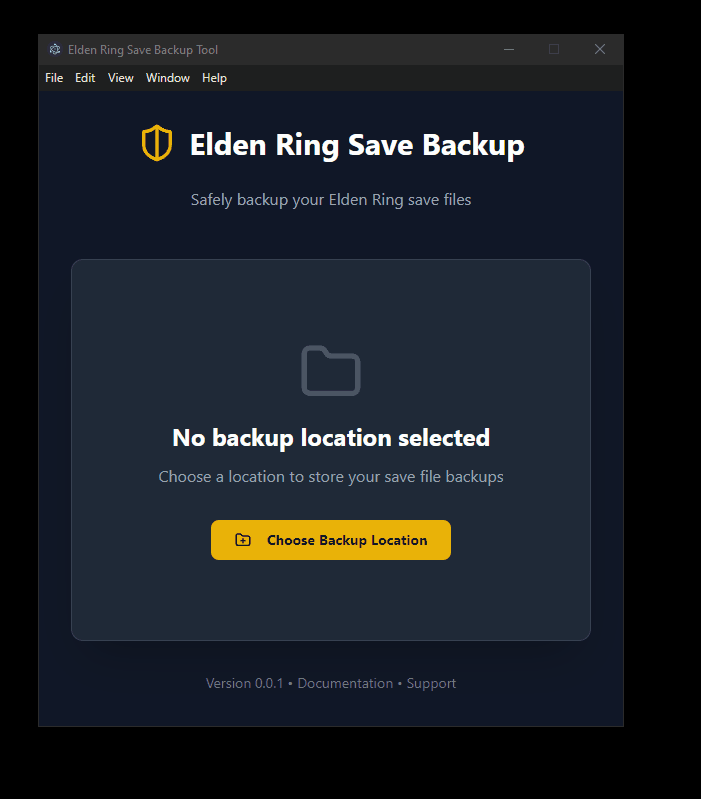

# Elden Ring Save Backup Tool

A simple desktop application that helps you safely backup your Elden Ring save files. Built with Electron and React.

<p align="center">
  
</p>

## Installation

1. Download the latest release from the [Releases](https://github.com/LuisM360/EldenRingSaveFileSaver/releases) page
2. Run the installer (or extract the portable version)
3. Launch the application

## How to Use

1. **First Launch**: When you first open the app, you'll need to select a backup location where your save files will be stored
2. **Select Location**: Click "Choose Backup Location" and select a folder on your computer
3. **Create Backup**: Click the "Create Backup" button to save your current game progress
4. **View Backups**: Your backups will be saved in the chosen location with timestamps

Each backup is stored in a separate folder with the format: `backup-YYYY-MM-DD hh-mm-ss AM/PM`

## Development

This project is built with:

- Electron
- React
- TypeScript
- Vite
- TailwindCSS

### Prerequisites

- Node.js 18+
- npm

### Local Development

```bash
# Install dependencies
npm install

# Start development server
npm run dev

# Build for production
npm run build

# Create distribution
npm run dist:win
```

## Technical Details

- Save files are located in: `%APPDATA%/EldenRing/`
- Backups preserve all file timestamps and attributes
- The app runs in a secure context with proper electron security practices

## Contributing

Contributions are welcome! Please feel free to submit a Pull Request.

## License

[MIT License](LICENSE)

## Support

If you encounter any issues, please file them in the [GitHub Issues](https://github.com/yourusername/eldenringsavefilesaver/issues) section.
